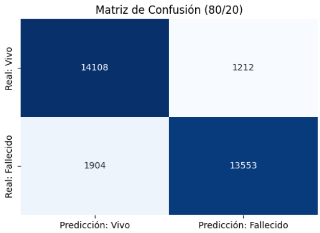

# Predicción de Riesgo de Mortalidad por COVID-19 (México)

Este proyecto desarrolla un modelo de aprendizaje automático supervisado para predecir la mortalidad en pacientes diagnosticados con COVID-19, utilizando datos clínicos y demográficos proporcionados por el Gobierno de México.

## Descripción
El objetivo es identificar tempranamente a los pacientes con alto riesgo de fallecimiento basándose en comorbilidades (Diabetes, EPOC, Hipertensión, etc.) y datos de ingreso. Se implementó un flujo completo de Ciencia de Datos que incluye limpieza, ingeniería de características y balanceo de clases.

**Fuente de Datos Original:** [Kaggle - COVID-19 Dataset](https://www.kaggle.com/datasets/meirnizri/covid19-dataset) (1,048,576 registros).

## Estructura del Repositorio
- `data/data_procesada_final.csv`: Dataset final listo para el modelo (Limpio, Normalizado y Balanceado 50/50).
- `Analisis_Mortalidad_Covid.ipynb`: Código fuente con todo el pipeline de procesamiento y evaluación.
- `images/`: Gráficos y resultados visuales.
- `requirements.txt`: Librerías necesarias para ejecutar el proyecto.

## Metodología Aplicada

1.  **Preprocesamiento:**
    * Imputación de valores faltantes (códigos 97/99) utilizando la moda.
    * Generación de variable objetivo binaria `IS_DEAD` a partir de la fecha de defunción.
    * Normalización de la variable `AGE` (Escala 0-1).

2.  **Balanceo de Datos (Undersampling):**
    * El dataset original presentaba un desbalance severo (93% vivos vs 7% fallecidos).
    * Se aplicó submuestreo aleatorio para igualar las clases, resultando en un dataset de entrenamiento equilibrado (~150,000 registros, 50% fallecidos / 50% vivos).

3.  **Modelo:**
    * Algoritmo: **Random Forest Classifier**.
    * Configuración: `n_estimators=100`.

## Resultados de la Evaluación

El modelo fue sometido a tres pruebas de estrés. A continuación se presentan los resultados de la división 80/20:

| Métrica | Resultado | Interpretación |
| :--- | :--- | :--- |
| **Accuracy** | **~92-95%** | Exactitud global del modelo. |
| **Precision (Fallecidos)** | **~78%** | De los que predijo que morirían, el 78% falleció. |
| **Recall (Fallecidos)** | **~62%** | Capacidad de detectar el total de fallecimientos reales. |

### Matriz de Confusión
El siguiente gráfico muestra el desempeño del modelo clasificando las clases (0: Vivo, -1: Fallecido):

*(Nota: Gracias al balanceo, el modelo evita el sesgo de predecir "Vivo" para todos los casos, logrando identificar una gran proporción de los casos críticos).*

